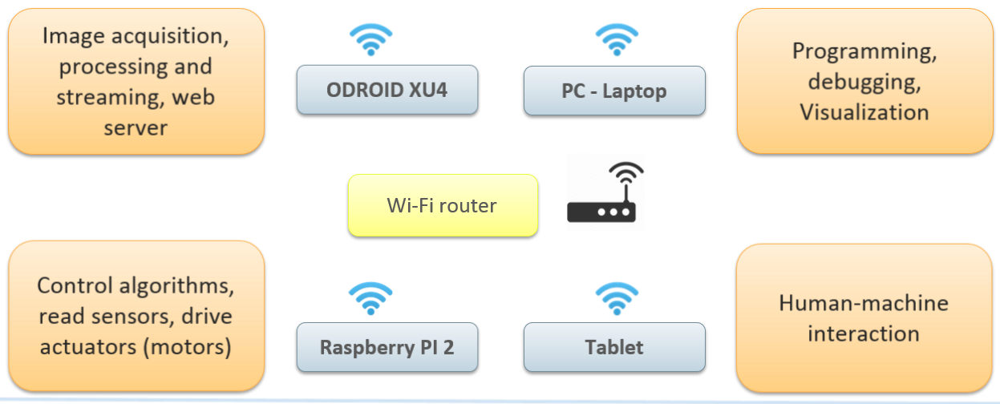
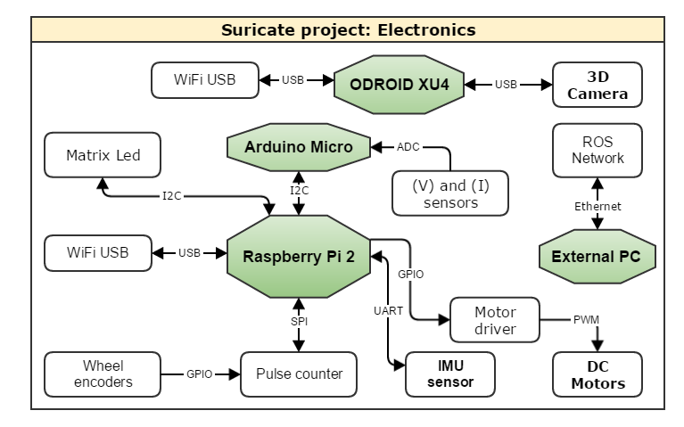
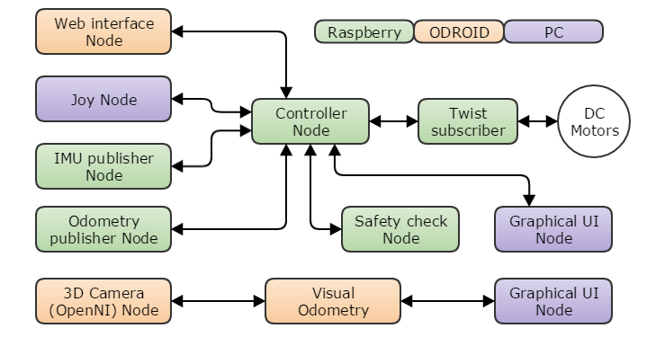
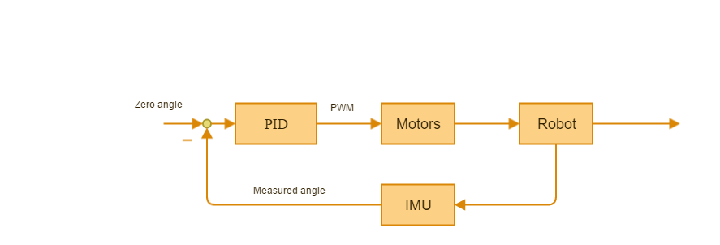

Description of suricate project
===============================

Developed using ROS (Robotic operating system) Kinetic under Ubuntu 14.04​
​
Source code was written in Python and C++​
​
Integrate external libraries such as OpenCV, NodeJS and MongoDB​.

- Main task distribution:

- Electronics:

The following figure shows how components are connected and which protocols were implemented.

- ROS nodes:
The following figure shows the ROS nodes which were developed for this project and which device execute each of them.

- PID controller:
The following figure shows a basic structure that represent the controller that we have developed.

