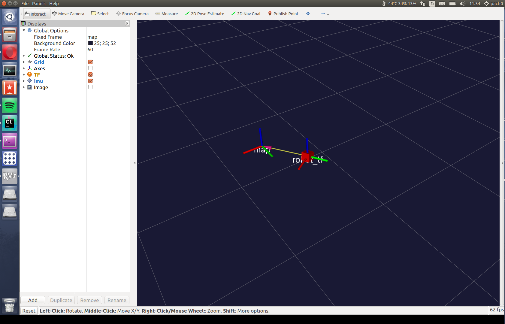
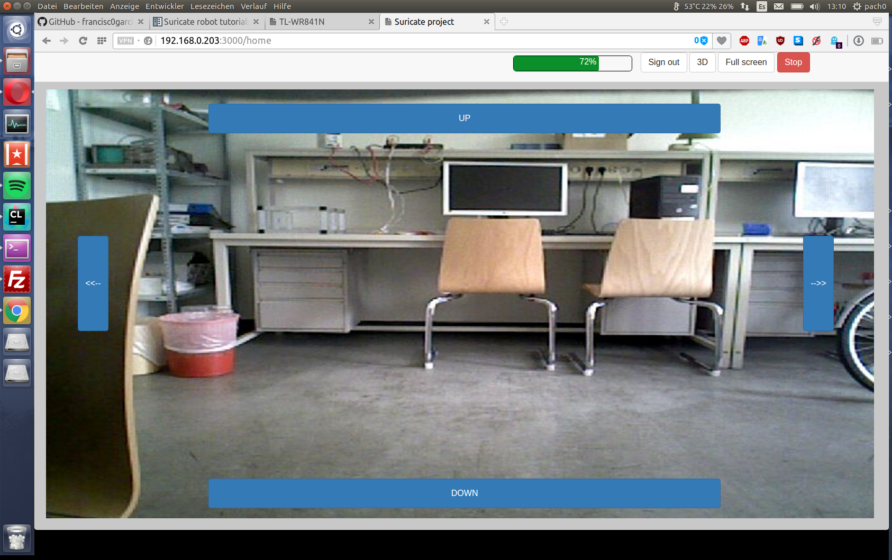

Suricate robot tutorials
========================

This section explain some examples of how to use the gazebo simulation and ROS in order to play
with the suricate robot and develop some extensions.

Initial considerations
^^^^^^^^^^^^^^^^^^^^^^

- Credentials for Raspberri PI 2: user **ubuntu** - Password **ubuntu**

- Credentials for ODROID: user **odroid** - Password **odroid**

- Suricate robot is pre-configured for connecting to WiFi network **suricate** and password **suricate2015**, router should assign automatically static IP address

Raspberry PI2- *192.168.0.201*

ODROID - *192.168.0.203*

PC - *192.168.0.105*

this is important for following steps.

- If you want to change WiFi network configuration on Raspberry or ODROID, please modify config file (you can connect MicroSD on external PC with linux):

.. code-block:: none

    sudo nano /etc/network/interfaces

- You can change I2C and SPI parameters modifying file:

.. code-block:: none

    sudo nano /boot/config.txt

How to start suricate robot
^^^^^^^^^^^^^^^^^^^^^^^^^^^

To run suricate robot, you need a working ROS project (explained on installation section).
Once it is working, you can execute the following steps:

1. Turn on robot and wait for WiFi connection (default network **suricate** and static IP **192.168.0.201**).

2. By default, ODROID is configured to act as ROS Master using static IP *192.168.0.203*, and it will start automatically as soon
as you power it on.

3. Use console to connect using SSH to raspberry PI2 (example: ssh user@IP_address):

.. code-block:: none

    ssh ubuntu@192.168.0.201

4. Start ROS nodes on RPI2 using the following commands:

.. code-block:: none

    cd ~/Documents/code/suricate_micro/
    source devel/setup.bash
    export ROS_IP=192.168.0.201
    export ROS_MASTER_URI=http://192.168.0.203:11311
    roslaunch robot_starter robot_starter.launch

By default, robot uses LQR controller that will start automatically, meaning that robot will stand up as soon as you execute robot_starter.launch,
you might also try PID controlled that requires an initial velocity command given by **/robot/cmd_vel** (usually provided if you connect a gamepad).

5. Now, if everything is correct, LED matrix should show a happy face. If does not do it, please check Frequent Questions section.

6. Open a new console and start PC ROS nodes for visualization and control, using following commands:

.. code-block:: none

    cd ~/catkin_ws/
    source devel/setup.bash
    export ROS_IP=192.168.0.105
    export ROS_MASTER_URI=http://192.168.0.203:11311
    roslaunch suricate_robot PC_launcher.launch

Recommendations:

It is possible that your ROS project is place on different location.

Connect a gamepad before running this nodes, if you want to control robot with it.

7. Previous command will open a RQT instance (graphical interface), you can check robot state by clicking tab "Topic monitor", and select a topic, for instance **/robot/imu**.
If Hz shows something between 80 to 130 HZ IMU is properly sensed and robot work OK.

.. image:: media/IMU_checking.png

You should also get a RVIZ 3D graph, which, as soon as you move the robot, shows a computed position and pose.

8. It is also possible to use web interface, please open a web browser (tested on Google Chrome and Opera) and write this address:

.. code-block:: none

    http://192.168.0.203:3000

you must create a new user with password in order to get access to robot interface

It is possible to check camera image, battery status and 3D computed pose.
If you use PID controller (select on raspberry_init.launch), you can also control robot using arrows on display.

